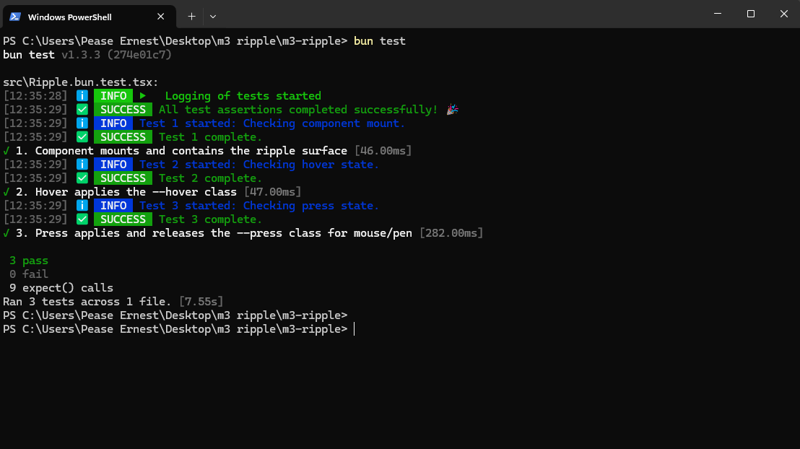

````markdown
# m3-ripple

Material Design 3 ripple effect for React ([demo](https://m3-ripple.saltyaom.com))

## Installation

```bash
npm install m3-ripple
````

## Usage

Put `Ripple` component inside any element, and set `position: relative`.

The ripple effect will automatically be applied when the element is pressed.

```jsx
import { Ripple } from 'm3-ripple'
import 'm3-ripple/ripple.css'

function Demo() {
    return (
        <button
            style={{
                position: 'relative',
                color: 'white',
                padding: '1rem 2rem',
                backgroundColor: '#6200ee'
            }}
        >
            <Ripple />
            Click Me
        </button>
    )
}
```

## Customization

Ripple color will inherits the color of the parent element using `currentColor`. You can customize the ripple color by setting the `color` property on the parent element.

```jsx
import { Ripple } from 'm3-ripple'
import 'm3-ripple/ripple.css'

function Demo() {
    return (
        <button
            style={{
                position: 'relative',
                color: 'red'
            }}
        >
            <Ripple />
            Click Me
        </button>
    )
}
```

## CSS Variable

You can set global CSS variables to customize the ripple opacity for hover and pressed states.

```css
:root {
    --ripple-hover-opacity: 0.08;
    --ripple-pressed-opacity: 0.12;
}
```

Otherwise, you can set the opacity using the `hoverOpacity` and `pressedOpacity` props.

```jsx
import { Ripple } from 'm3-ripple'
import 'm3-ripple/ripple.css'

function Demo() {
    return (
        <Ripple hoverOpacity={0.1} pressedOpacity={0.15} />
    )
}
```

## Props

Here's a type definition of the props you can use with the `Ripple` component:

```ts
export interface RippleProps {
    /**
     * Disables the ripple.
     */
    disabled?: boolean

    // ... (rest of the props definition)
    hoverOpacity?: number
    pressedOpacity?: number
    className?: string
    style?: React.CSSProperties
    easing?: 'cubic-bezier(0.2, 0, 0, 1)'
    duration?: number
    minimumPressDuration?: number
    touchDelay?: number
}
```

-----

-----

## 🧪 Proof of Quality & Testing ✨

The `m3-ripple` component is rigorously tested using **Bun Test** and **React Testing Library** to ensure reliable and correct behavior across all modern input types.

All core interaction states are verified:

1.  **Mounting:** Ensures the ripple surface is correctly rendered.
2.  **Hover State:** Confirms the application and removal of the `--hover` class on mouse enter/leave.
3.  **Press State:** Verifies the correct application and release of the `--press` class, along with the initiation and termination of the Web Animations API (WAAPI) effect.

### Test Results

A successful test run is essential before every merge, guaranteeing the component's stability.



*(Note: Test logging is handled by the **[Ernest-Logger](https://www.npmjs.com/package/ernest-logger)** package for improved developer experience.)*